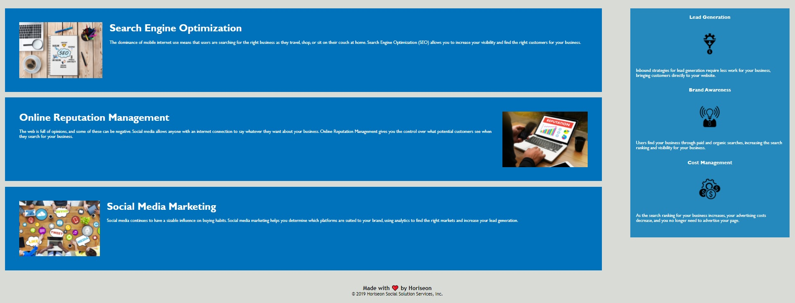

# Horiseon-Refactory HTML and CSS Optimization

## Website URL
https://abhi20220.github.io/Horiseon-Refactory/\

## Goals
I built this project because the client wanted their site to have accessibility standards for users that may have an impairment. 

## Problems 
There were a few evident problems within the structure of the HTML framework. "Search Engine Optimization" contained within the "navigation" class was not correctly linked to the "Search Engine Opimization" within the "content" class.

To improve accessibility standards, I have created alternate texts for images for users that are not able to see the image properly. 

I have also condensed multiple CSS elements so it is less messy into one catagory so it still has the same effect and looks cleaner.  

## Completed Requirements

```
1. Added a title to the Horiseon webpage.
2. Added semantic HTML and CSS.
3. Condensed complementary CSS into simpler CSS styles to make it look cleaner.
4. Added informative alternative texts to images which will help users with vision impairments.
5. Commented throughout CSS and HTML.
```

## Web App Overview


